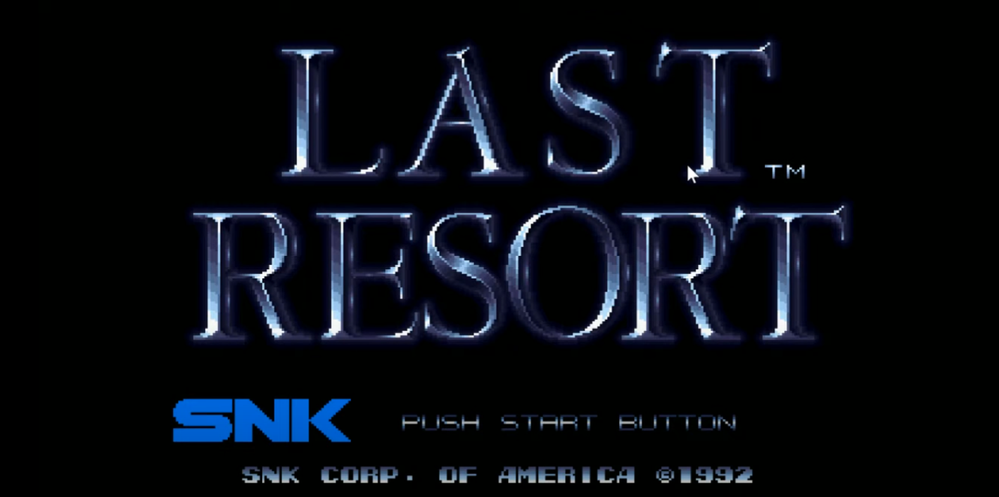
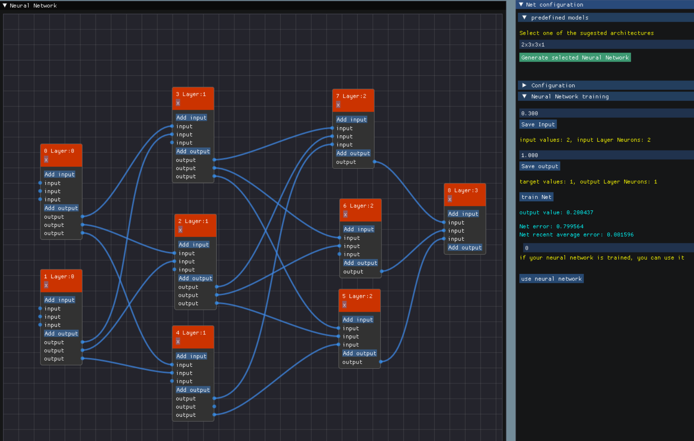

Jaume Avinyo: Programmer

## My objectives
I’ve recently finished my university degree in video game development and design and I’d like to incorporate to the video games industry as soon as possible.
I’m open to an internship or a full time job as a c++/gameplay programmer.  I could start working with you as soon as you need me.

### Knowledges
I’m a programmer, but I also studied 3D modeling and animation in programs like 3D studio max, blender and zBrush. I also know about level design, world building, UI and game design in general. This knowledge allows me to communicate with other co-workers, and understanding their needs and their work allows me to have good communication between departments.

I’m mainly a c++ programmer, a language that I’ve used to create games in custom  2D and 3D engines. I’ve also been gameplay programmer in projects in which I’ve used lua or c#. As a programmer I’ve created lots of necessary systems for the games I’ve worked on, some of them are: 2D and 3D cameras, audio systems, input systems, entity and crowd managers, pathfinding, custom UI, loading and  rendering 2D images and 3D mesh importer for 3D studio max files, material loading, 3D transforms, file systems, frame rate and delta time control, etc. I’m not saying I’m an expert in all those systems and I know that as a junior I have a lot to learn, but I’ve created all of them for my projects and I can say I can do it again!

As a game developer, I’ve been present in most areas and all the stages of the development in different projects that you can explore below.

## Personal Projects

I'm always working to further develop my c++ coding skills, but I also work on other mini projects such as the following ones:
### 3D shader
I wanted to explore a bit the shaders world and learn about mathmatics that make them possible. To do so, I created a shader in shadertoy.com that has the following features: 
- 3D rayIntersections to draw soheres and planes taking into account  intersections between them.
- Local illumination (ambient, diffuse, specular).
- Hard shadows.
- Reflections.
- Distance fog.
- plane patterns.

Click on the image to access the shader source code and render in real time:

### 2D character movement and attack system

A mini project to show character movement and attack in unity.
The character works with a FSM that handles states written in separate scripts. This mini project also uses camera movement script and parallax script for the background.

Click on the image to access the video

## Game Jam Projects

### Project Rebirth 
Project rebirth is a game done in my university anual game jam. It had been developed in 24 hours and it is about resources management in which you have to get to a balance between production and polution to gain resources not destroying the planets you visit and achieving a perfect balance. 

Click on the image to access the promotional video

[Visit the WebPage here](https://lostsignalstudio.itch.io/project-rebirth) 

## Student Projects

### The Witcher Ties of Destiny
“The Witcher Ties of Destiny” was a game developed in four months by a
class of 20 video games students. It was fully developed in our own c++
OpenGL game engine while this was still in development. This game was
highly liked by professionals from companies like Digital Legends, RayLib
Technologies or Lince works.
I was in charge of: Designer and gameplay programmer

Click on the image to access the video

[Visit the WebPage here](https://tiesofdestiny.com/) 

### Mercury Engine
"Mercury engine" is an OpenGL 3D game engine developed in 4 months from scratch programmed in C++ and other libraries such as SDL, DeviL, Assimp, and ImGui . This project pretends to create a game engine which is able to load, import and play animations from fbx models that have been animated in an external animation software such as maya, blender or 3DsMax.

Some functionalities are: 

- Camera: Can create a camera which has a component camera, where you can activate the camera culling and change the fov.

- File System: Every time a file is being dropped in the engine, it stores the file in a own file format to make it faster to read, loading all the info and also maintaining a     relation with a .meta file for each file (Models and Textures)

- Importer
  Material: It load the texture of each model we are importing to store it as a resource and use it later the times we need
  Mesh: Loads a Mesh of a mesh and gets all the models data (vertices, indices, texture coords) to use it later for each object in the Engine.
  Bones: It loads all the bones of each mesh of the model, and stores them individually with its weights and the vertices they are affecting each bone.
  Animations: It loads the animations of the model with all the keyframes of each bone.
  
- Renderer: It renders the models in current time, having the ability to choose in execution time some configurations of render(Depth, Culling, Colors, Textures) enabling and disabling them.

- Resources: Each Mesh, Material, GameObject is stored in separated files with our file format and loaded once in memory.

- Animator: The animator controls the animations of each object, it executes and bind in pose the model every frame, controlling the time of the animation and the positions of the bones that will change the position of the mesh. 
  
  
Click on the image to access the video

[Visit the GitHub Page here](https://github.com/knela96/Mercury-Engine) 

### Order 227, Not a Step Back
“Order 227, Not a Step Back” Is an RTS game developed during my second
year in a team of 7 programmers. Fully developed in c++ using SDL library.
I was in charge of: Team Manager

Click on the image to access the video

[Visit the GitHub Page here](https://cutt.ly/Dh0o84m) 

### Almos Hero
Almost Hero is a "Guitar hero" style game developed fully in c++ in 3 weeks.

Click on the image to access the video

[Visit the GitHub Page here](https://cutt.ly/8h0o4MY) 

### Last Resort
Last Resort was my first c++ video game where we had to recreate a full level of
the famous game Last Resort from NeoGeo:
I was in charge of Q&A (as a personal responsibility, but programmed the game as my 3 team
mates)

[Visit the GitHub Page here](https://cutt.ly/Dh0pqJL) 

### Easy neural networks
Final degree project with a prototype still on development.

What if we could use deep learning to figure out which are the best stats to balance a game? What if designers could spend more time on other tasks and not raking their brains trying to find the perfect number to make a fair game? 
When I think of a way to automate finding perfect numbers in any field in software development, the first that comes to my mind are neural networks. But there is a problem with this solution, you need engineers to program a neural network. And now imagine that is only going to be used for a simple task. It seems clear that we can not pass to programmers the design work to liberate designers from these tasks.
For this problem I have an obvious solution, let's make designers create their own neural networks in less time and effort than it would be necessary to solve the same problem without it. To do so, **I've created a prototype that allows anyone to create and train a neural network**.

## Work experience:

-Q&A department in [Cirsa](https://www.cirsa.com/), a leader company in gaming and betting sector in spain.
  3 months of internship from june 2019 to september 2019.
  
-Customer service and computer repair in a [OfertasPC](https://www.ofertaspc.com/)
 1 year and 9 months from january 2020 to september 2021.

## Academic education

### Bachelor's degree in Video Game Design and Development
(2017 – 2021). Barcelona – CITM / UPC
● Currently at my fourth year
● Fully done in english 

### Scientific bachillerato
(2015 – 2017). Institut Pare Manyanet - Les Corts. Barcelona

### Language studies
● (July 2014. 2 weeks) Cambridge. England
● (July 2015. 5 weeks) International School of languages. University of San
Diego. California. EEUU
● (Julio 2016. 3 weeks) St. John’s School. Canterbury England
● (2017, 11 meses) Aston School - Sarriá. Barcelona

